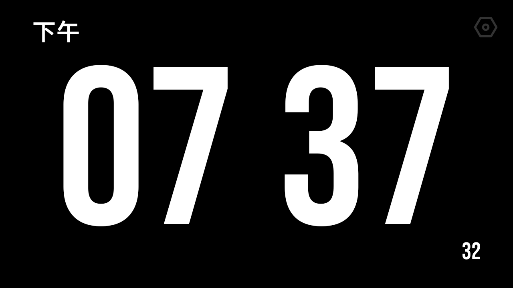
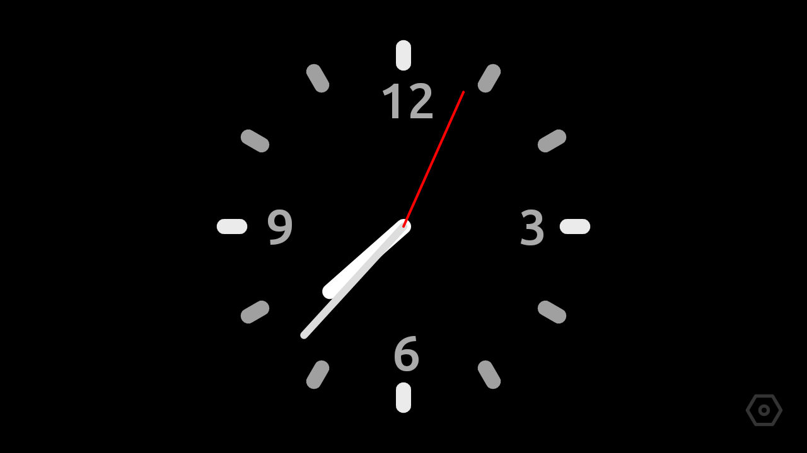
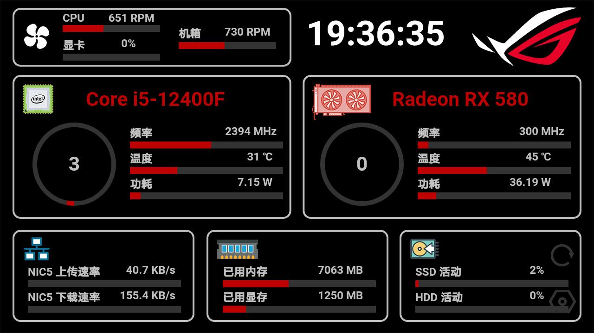

# FSClock

一个轻量化、多功能的全屏时钟Android APP。

从现在开始，将你正在抽屉里吃灰的老旧手机作为一个桌面时钟/助手吧！

## 功能特性

- 轻量化。
- 最低支持到Android 5.1（2015）。

- 目前有如下主要功能：
  - 数字时钟
    
  - 模拟时钟
    
  - Windows性能监控（基于WebView，需配合AIDA64）
    

- 放纵的自定义设置。
  - 选择启动时的默认界面
  - 自由选择是否开机自启
  - 自定义模拟时钟的几乎所有部件，例如表盘、刻度、指针

## 使用方法

开箱即用。

开启后默认进入设置页面，**目前仅页面设置栏、其它栏下的设置开发完成**。

设置完成后**横划切换**不同的功能。

## 系统需求

- Android >= 5.1
- Windows + AIDA64 (Only needed by System Monitor)

## 安装

FSClock现可通过[Github Release]([Releases · HRPF/FSClock (github.com)](https://github.com/HRPF/FSClock/releases))下载安装

## 未来开发计划

[TODO list](TODO.md)